УРОК 6, ДЗ

Результат добавления фильтров по видеоуроку
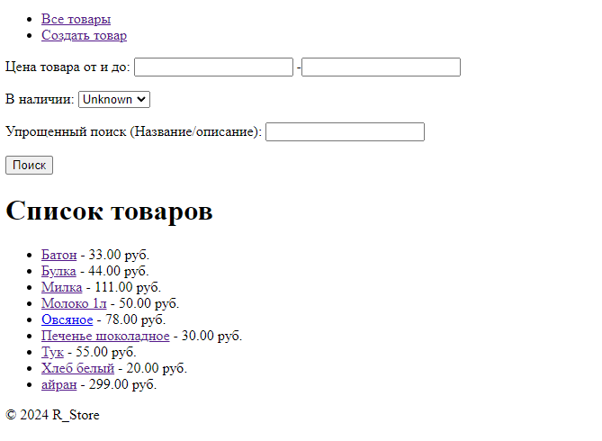

Цена товара от 30 до 100 руб.
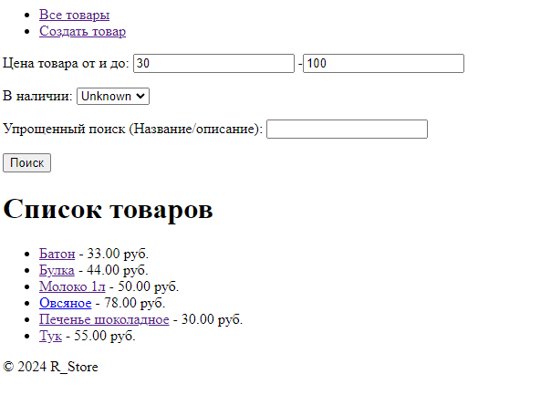

Товары, которых нет в наличии
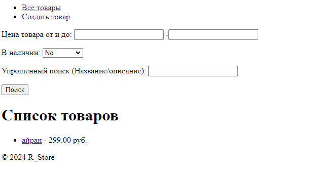
Товары, которые есть в наличии
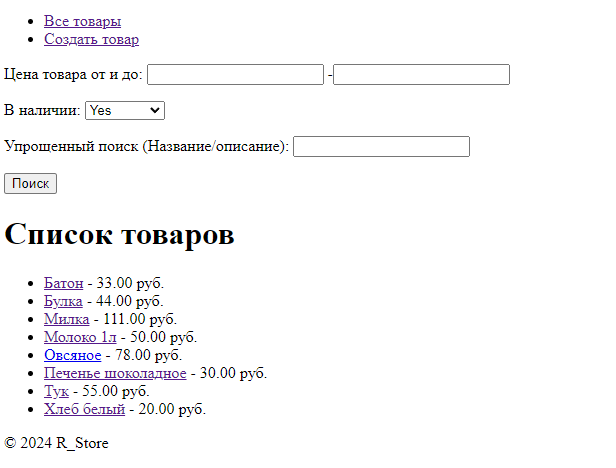

Поиск товара "Бат" (название)
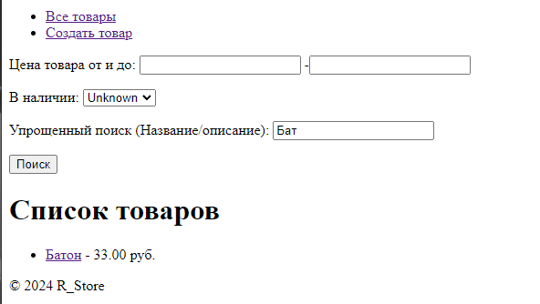

Поиск товара "М продукт" (название + описание)
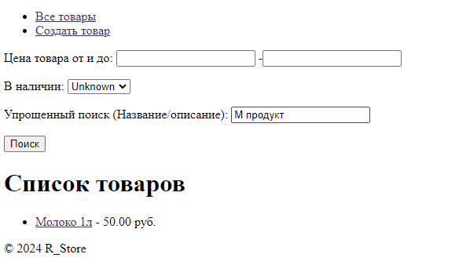

Кастомный фильтр (выбор категорий + цена до 35)
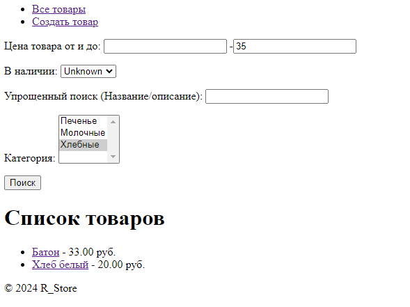, выбор категорий + описание 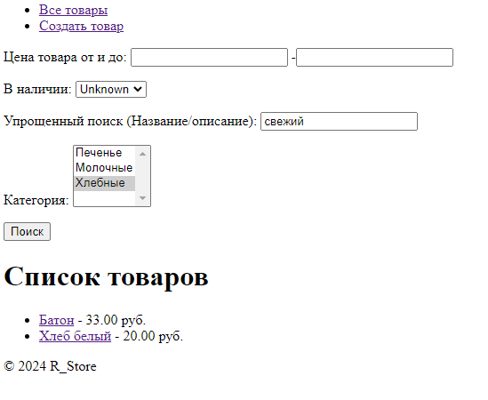

##################################################################################################
##################################################################################################
##################################################################################################

УРОК 5, ДЗ

1.Объекты модели

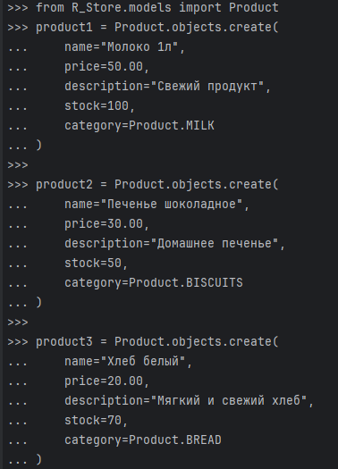
 
Результат выполнения 3х запросов
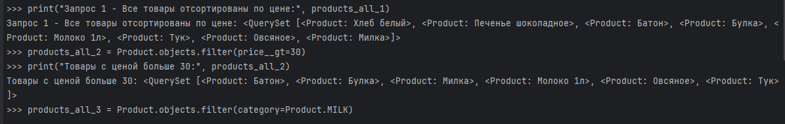

2.1. Результат filter
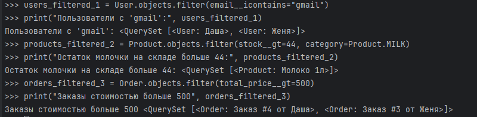

2.2. Результат exclude
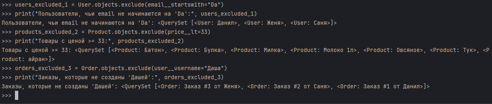

2.3. Результат order_by
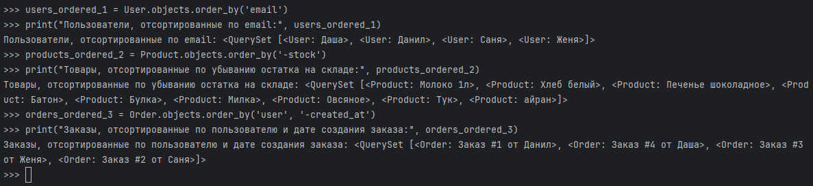

3.1. связь моделей
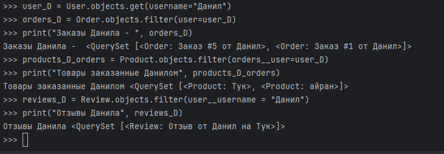

3.2. Результат values
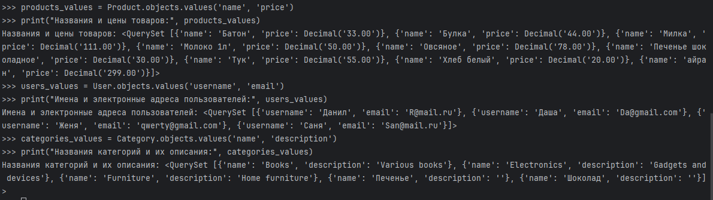

3.3. Результат values_list
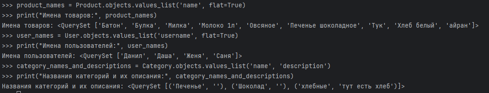

4.1. Результат AND
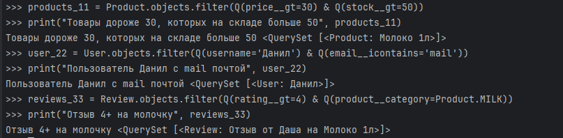

4.2. Результат OR
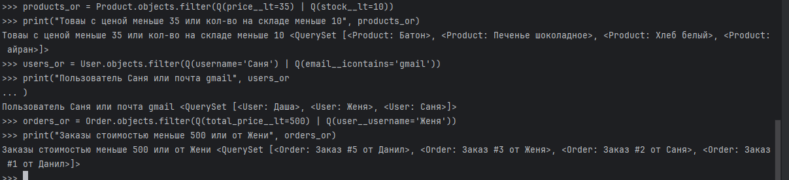

4.3. Результат объединения
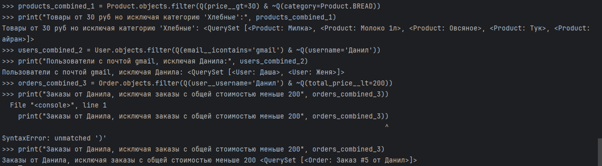

5.1. annotate
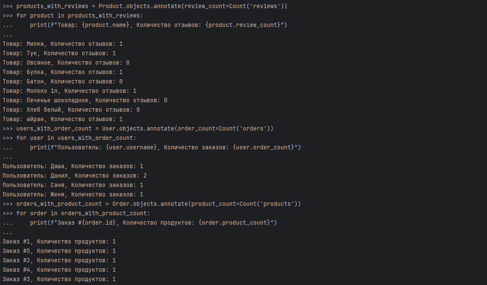

5.2. aggregate
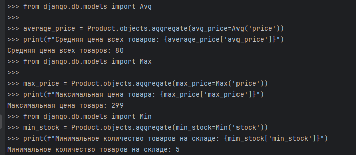

#################################################
